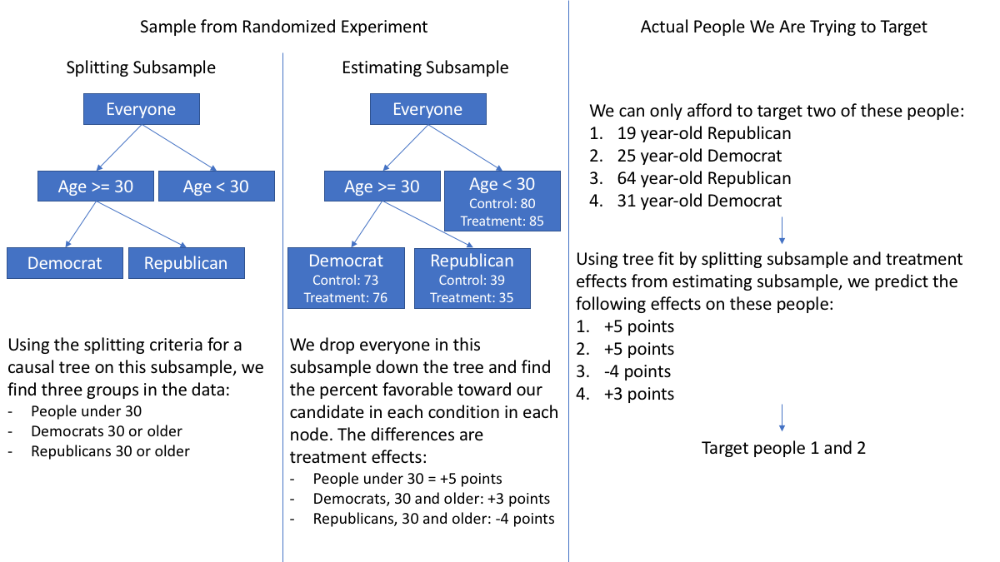

```{r setup, echo = FALSE}
options(scipen = 1, digits = 3)
```

In this post, I argue for and demonstrate how to train a model optimized on a treatment's causal effect. This involves predicting the *lift* a treatment is expected to have over the control, which is defined as the difference in an outcome *Y* between treatment and control conditions. This stands in contrast to most supervised learning algorithms, which focus on predicting *Y* and tend to ignore causality.  

But there is a growing literature focused on causality in machine learning, which I refer to generally as "heterogeneous treatment effects." In the last few years, a number of interesting papers have been published on the estimation and prediction of treatment effects. There still exists a gap, however, between those proposing these methods and those who would benefit from using them. My goal here is to bridge this divide by demystifying these models and showing R code for doing these analyses. After discussing some background and alternative approaches, I will focus on my favorite heterogeneous treatment effect approach, the **honest causal forest**, and its associated R package, `grf`.  

# Use Cases

Estimating heterogeneous treatment effects (HTEs) can be useful when one is interested in targeting individuals for an intervention. In medicine, one might want to find the people who will be most helped (or least harmed) by a drug or therapy. In marketing, one could be interested in retaining subscribers by targeting those people most likely to be swayed by some appeal to stay with the service (Ascarza, 2018). The practice of HTEs in these fields is also referred to as personalized medicine and personalized marketing, respectively. The recurring example I will use in this post is the field in which I work: political messaging. Who should we try to persuade to vote for our candidate or to donate money to their campaign? Which doors should we knock on? Which people should we tell to go vote? In all of these examples, we are trying to cause—to bring about—some behavior or attitude change, and the question is: Who should we target with our intervention aimed at causing this behavior?  

The objective here, put broadly, is to maximize lift (i.e., the treatment effect). To do so, we run a randomized experiment; in a given sample, half are randomly assigned to some treatment intervention, while the other half are assigned to a control or placebo group. I define lift as the difference between the expected outcome in the treatment minus the expected outcome in the control. If our outcome is dichotomous (e.g., yes or no, did vote or stayed home), the lift is the probability of the desired behavior in the treatment minus the probability of the desired behavior in the control. For example, if 55% of the people in the treatment voted, while 50% in the control voted, our lift would be 55% - 50% = 5 percentage points. If our outcome is continuous (e.g., how much money someone donated, how favorably they view our candidate), then the lift is the mean in the treatment minus the mean in the control. For example, if the treatment yielded a \$10.00 average donation and the control yielded \$7.50, then the lift would be \$10.00 - \$7.50 = \$2.50.  

After running the experiment, our goal is to train a model on the expected lift for every individual. These estimates may vary widely between different subgroups in the sample, which is where the name *heterogenous* treatment effects stems from. We then apply this model to future potential targets, and we deliver our treatment to those who the model predicts will have the biggest expected lift. I discuss some common alternative strategies before discussing methods that estimate HTEs.  

# Other Common Strategies

**Neutral or Uncertain.** This strategy involves targeting people who have neutral or uncertain attitudes on some issue and delivering them persuasion messages. Those attempting to persuade people that their candidate is qualified, for example, might choose to target people who said "Don't Know" or "Neither Qualified nor Unqualified" to the question: "Do you find Candidate X to be qualified?" The idea would be to survey a sample on this question, train a machine learning model to predict what types of people give these responses, and then target those types of people.  

**Importance.** Find what people are passionate about and deliver them messages about those passions. A good example for this is a get out the vote (GOTV) operation. Similar to the above strategy, one would conduct a survey on a number of issues, pinpoint the issues people say they agree with and are very important to them, train a model to score likelihood of being in agreement with and passionate about an issue, and then deliver a message focused on how voting affects that issue to people scoring high on the model.  

**Personas.** A third strategy might be to classify people into *k* groups and tailor messages to what makes these groups unique. In a [previous post](https://www.markhw.com/blog/democratkmeans), I talked about how one could survey people who identify as Democrats, cluster them into groups based on their attitudes toward 17 different issues, and then develop messages that adhere to what makes those groups unique. Does one group of Democrats have much stronger attitudes about immigration? Target those people with immigration-related messages. One group is very liberal on every issue? Target those people with the most progressive messages, and so on.  

## Optimization Problems

The problem with each of these three approaches is that **they do not optimize directly on what we are interested in—the lift.** This means that we may have one goal in mind (maximizing lift), while the above approaches optimize on a separate goal. It may very well be that the two goals overlap at times, but there are likely many times where they do not. In any statistical learning problem, it's important to know what an algorithm is optimizing on and making sure the goals of that procedure align with what you are interested in.  

So what do the above approaches optimize on, if not the lift? Keep in mind that the lift is the difference between our outcome *Y* in the treatment and control conditions: *Y*(Treatment) - *Y*(Control).  

- *Neutral or Uncertain.* We might define this by finding the middle portion of the distribution in the pre-score (or modeled score) of an outcome of interest *Y* and then targeting people with scores in that range. Let's say *L* is a lower cutoff—it is some number where the people below have "strongly" negative attitudes—and *U* is the upper cutoff, where people above this number have "strongly" positive attitudes. This approach would be implicitly optimizing on: *L* < *Y* < *U*. This may be particularly unhelpful if people opt for "neutral" or "don't know" options as a way to opt-out of answering the question at all—not because they don't actually have a view. In this case, one would actually be optimizing on something completely different: A person's likelihood to not want to give an answer on a questionnaire.  

- *Importance.* We could define this by finding people who both (a) strongly support an issue and (b) say the issue is very important to them (again, based on pre-scores or modeled ones). Let's call *S* how much someone supports the issue and *I* how important it is to them. We could again define an upper cutoff *U* where people above this threshold strongly support the issue and say it is very important. The behavior we are interested in *Y* might be donations to a campaign. We would be implicitly optimizing on: *U* < *S* and *U* < *I*, where *S* and *I* are assumed to be related to the main outcome *Y*.  

- *Personas.* Unsupervised approaches generally take *p* number of variables and a user-input *k* number of groups, then maximize the variance between groups and/or minimize the variance within the *k* groups on these *p* variables. Other algorithms, like my favorite DBSCAN, use a non-parametric procedure to group points together that are nearby in *p*-dimensional space. Note that some measure of *Y* may or may not be present in the variables used for clustering.  

Each of these approaches are face valid and can provide benefit at times. However, they do not explicitly model what we are interested in—that is, how much someone will be influenced by our treatment.  

# Finding Heterogenous Treatment Effects

The above strategies do not optimize explicitly on causal effects, but there are some models that do. Before surveying approaches for estimating HTEs, I discuss important theoretical background.  

## Theoretical Background

The goal is to estimate the causal effect for an individual: *Y*(Treatment) - *Y*(Control). Most papers I've read proposing, implementing, or reviewing algorithms that do this generally frame this problem within the Rubin causal model (a.k.a., potential outcomes model). This approach defines causality strictly: It is the value we would have observed if a person was in the treatment, minus what we would have observed if a person was in the control. There's a problem here, since a person can only be in one condition at a time. If someone is assigned to the control condition, we never observe the outcome if they had been in the treatment condition (and vice versa). Note that this is why the "would have" language is used, which highlights that these outcomes are "potential."  

Under this framework, getting the true causal effect requires actual magic: We take our world, split it into two universes, have an individual in Universe 1 go through the treatment and that same person in Universe 2 go through a placebo, then compare the outcomes from Universes 1 and 2. This impossibility is what Holland (1986) referred to as "the fundamental problem of causal inference."  

So what do we do? One solution is to get two large groups of people that are similar to one another, assign one of these groups to the treatment, the other to the control, and then compare the expected outcome (e.g., mean response or probability of a behavior occurring) between the two groups. This gives us the average treatment effect (ATE)—the lift across all people in the sample. When I say that the two groups are "similar," I mean that we assume miscellaneous characteristics about these people that could influence either (a) what treatment they experienced or (b) their potential outcomes *Y*(Treatment) and *Y*(Control) have been accounted for. The gold standard for doing this is conducting a randomized experiment, where people are chosen at random to be either in the control or treatment condition. Since I am only going to consider estimating HTEs within the realm of an experiment, I don't discuss ensuring this assumption further.  

The estimated ATE described above is across everyone, but we want to know the treatment effect for *a given individual* so that we can decide whether or not to target them. But we can only ever measure *Y* in the treatment *or* control—so what do we do? Crudely put, all of the algorithms I mention below more or less search out *similar others* and use them as stand-ins for a given person's potential outcome. For example, imagine the only variables researchers had were race, gender, generation, political affiliation, and education. My estimated treatment effect would be the mean outcome for White, male, millennial, Democrats with a graduate degree in the treatment condition minus the mean outcome for this subgroup in the control condition. I hope this demystifies the process a little bit. No matter how complicated equations may get in a HTE paper, this is generally what authors are trying to do: Compare the outcomes of people with similar covariate profiles in different conditions and use these differences as estimates of a treatment effect. We then assign that treatment effect to everyone in that specific subgroup, and any future people we are trying to target are assigned that same treatment effect. We can use these predicted treatment effects to inform targeting.  

## Heterogenous Treatment Effects: An Overview

If you learned statistics in the social sciences like I did, the practice of finding which variables predict a bigger treatment effect might sound familiar. In experimental psychology, we would call this looking for "moderators" of the treatment effect. And indeed, this is very close to what we are trying to do here. If an experimental social scientist wanted to find out which groups demonstrate the biggest treatment effect, they would say just fit a regression model with an interaction between a covariate and the treatment indicator. If this interaction term is significant, then the treatment's effect depends on the covariate. From there, we could estimate HTEs by calculating the predicted values for people in both conditions at that level of the covariate, subtract the control from the treatment condition, and that would be the conditional average treatment effect (CATE). This is called the "conditional" average treatment effect because it is the average treatment effect *after* being conditioned on the covariate.  

Thus, we could use traditional regression to estimate HTEs. For a simple example, imagine that there is a treatment condition (*T* = 1) and control condition (*T* = 0). We look at Democrats (*X* = 1) and Republicans (*X* = 0), and we are trying to model favorability toward our candidate (*Y*). We would fit a regression model with main effects for *T* and *X*, as well as the interaction between the two. Imagine that we find the interaction is significant, *p* < .01. This means that our treatment effects are heterogeneous—there are HTEs. We would then find out what *Y* is for Democrats in the treatment and control conditions. Let's say Democrats in the control condition were favorable toward our candidate 80% of the time. In papers on HTEs, this is often written by saying the expected value, *E*, of *Y*, given that *T* = 1 and *X* = 1 is 80%, or *E*(*Y* | *T* = 0, *X* = 1) = .80. Now let's say Democrats in the treatment condition were favorable toward our candidate 85% of the time, *E*(*Y* | *T* = 1, *X* = 1) = .85. We could calculate these two expected values in the treatment and control conditions, given the value of the covariate, and get the CATE: 85% - 80% = 5 percentage points. We would then assign every Democrat to have a treatment effect of 5 points.  

So why the need for more complicated algorithms to find HTEs? The above example was very simple: It only involved one covariate. Usually, we don't just have one *X* variables, but many *X* variables. If we have 12 variables we are interested in using to estimate HTEs, we would then feasibly test if the 13-way interaction is significant, if all 12-way interactions are significant, and so on. This approach suffers from a lack of statistical power, and fitting that many interactions would cause us computational issues. A *p*-value threshold of .05 is also arbitrary—we might have better performance in predicting treatment effects on a covariate, even if the interaction had a *p*-value of .06. In still other situations, this approach might overfit the data. Using ordinary least squares regression also imposes linear relationships, unless we want to fit even more interactions with polynomials. Luckily, researchers have found better ways to estimate HTEs.  

As I said in my introduction, I will focus on the honest causal forest. But many other approaches exist in this growing research area. Chen, Tian, Cai, & Yu (2017) proposed a unified framework for estimating treatment scores, and Huling & Yu (2018) coded this into an R package called `personalized`. This framework is regression-based, except the entire model doesn't need to be fit—only the interaction effects are focused on. This doesn't guarantee an accurate measurement of the treatment effect, but it retains rank-ordering (which is what we need to figure out which people to target), and the zero is still meaningful, so any positive estimates refer to positive treatment effects. I really like this approach, because it is general: The authors show that any loss function that meets some requirements can be used with their estimators. The `personalized` package lets the analyst fit regression equations with LASSO constraints, generalized additive models, gradient boosted decision trees, and so on.  

Additionally, Imai & Ratkovic (2013) show a procedure where one can estimate HTEs by rescaling covariates and fitting a squared loss support vector machine with separate LASSO constraints on the coefficients for the main effects and on the coefficients for the interactions. This approach is available in the `FindIt` R package. Uplift random forests (Guelman, Guillen, & Perez-Marin, 2015) fit a forest of "uplift trees." These are similar to the causal trees I will describe, but they use a different estimation procedure and splitting criteria. This approach is available in the `uplift` R package, along with a k-nearest neighbors method for estimating treatment effects. Bayesian additive regression trees can be fit using the `bart` R package and used to estimate treatment effects. This was most famously shown by Green & Kern (2012) in the context of a GOTV experiment. Like the traditional regression approach described above, treatment effects are estimated by taking the expected value of the dependent variable in the treatment and subtracting the expected value in the control.  

Lastly, it should be noted that a lot of approaches for estimating HTEs do *not* try to create a treatment score for each person. Instead, they aim to find subgroups that show a positive treatment effect. This could certainly be used for targeting, but I see these approaches and their associated R packages as distinct from (albeit very closely related to) assigning expected treatment effects to individuals. I hope to cover this in a future post.  

# The Honest Causal Forest

The honest causal forest (Athey & Imbens, 2016; Athey, Tibshirani, & Wager, 2018; Wager & Athey, 2018) is a random forest made up of honest causal trees, and the "random forest" part is fit just like any other random forest (e.g., resampling, considering a subset of predictors, averaging across many trees). Because of this, I will assume you know how decision trees and random forests work; I will focus on what makes the honest causal tree unique from a typical decision tree by answering two questions: What makes it causal? What makes it honest?  

## What Makes It Causal?

The tree explicitly searches for the subgroups where the treatment effects differ most. When I say "explicitly," I mean that it is baked into the criteria the tree uses to determine where to make splits. A typical regression tree might split the data by asking, "What variable and value would reduce the mean squared error the most if we made a split at that value of that variable?" In doing so, the typical tree predicts *Y*. We are interested in the treatment effect for an individual, though. The problem here is that we cannot observe this—remember, someone is only assigned to *one* of the conditions. What do we do instead? We get the difference in *Y* between the treatment and control conditions *within* a leaf of the tree, and we call that the treatment effect. The causal tree uses splitting criteria that explicitly balances the two things we are trying to do: first, finding where treatment effects most differ, and second, estimating the treatment effects accurately. Thus, the tree is "causal" because it is fit by asking the data, "Where can we make a split that will produce the biggest difference in treatment effects across leaves, but still give us an accurate estimate of the treatment effect?" This is one of the reasons I prefer the honest causal forest—most other methods just try to predict *Y* and then get the difference between the expected value of *Y*, given some covariates *X*, between conditions.  

## What Makes It Honest?

An important question to ask is how to prevent overfitting on this causal splitting criteria. If we are searching out areas of the data where treatment effects are different from one another, how can we be sure that we aren't just finding noisy areas that differ just due to random quirks in our data? We make it *honest* by taking our training data and splitting it into two subsamples: a *splitting* subsample and an *estimating* subsample. We use the splitting criteria described above and apply it to the splitting subsample, which builds us a causal tree. We then apply the tree to the estimating subsample. Each case of the estimating subsample is dropped down the tree until it falls into a leaf (i.e., terminal node). We then estimate the treatment effects within each leaf by taking the difference between the mean of the treatment and the mean of the control cases (if we are predicting a binary variable, it is coded as 1 and 0, and the mean gives us the probability of observing 1). These estimates are what will be used for any future cases to which we apply the model. This might be difficult to follow, so see the figure below on how this might work in a very simple real-world scenario (note that the causal forest would fit many of these trees and average across them).  

---

```{r flowchart, echo = FALSE, , out.width = '65%', fig.align = 'center'}

```

---

An added bonus to fitting the causal trees honestly is that Athey and colleagues have shown that these treatment effect estimates are asymptotically normal (perhaps the biggest contribution of this approach, in the eyes of some theoretical statisticians and academics, is this asymptotic normal theory). This is fancy language for: As the sample size approaches infinity, the treatment effect estimate is normally distributed. Practically, this means that we can calculate the variance and 95% confidence intervals. Setting aside the well-documented problems with *p*-values and null hypothesis significance testing, this is very useful for a practitioner because it allows us to appreciate the inherent uncertainty in our predictions. It also means that we could use this model to just target anyone who has an expected treatment effect to be statistically significantly above zero.  

# A Worked Example

I'm using data from Broockman & Kalla's (2016) study on door-to-door canvassing as a way to reduce transphobia. The specific data I'm using come from the first follow-up they conducted three days after talking to registered voters. Households were randomly assigned to an intervention or control condition. In the intervention condition, canvassers talked to the participant about transgender issues in the upcoming election, showed a video that discussed both sides of the issue, and then encouraged the participant to take the perspective of someone who is transgender. In the control, the canvasser talked to the participant about recycling. The primary dependent variable is how the participant feels about transgender people, on a scale from 0 (very negatively) to 100 (very positively). After doing a little bit of cleaning, the data look like this:  

```{r load_data, echo = FALSE, message = FALSE}
library(tidyverse)
library(grf)
dat <- read_tsv("broockman_kalla_replication_data.tab") %>% 
  filter(respondent_t1 == "1.0" & contacted == "1.0") %>% 
  transmute(
    treatment = factor(ifelse(treat_ind == "1.0", "Treatment", "Control")),
    trans_therm_post = as.numeric(therm_trans_t1),
    trans_therm_pre = as.numeric(therm_trans_t0),
    age = vf_age,
    party = factor(vf_party),
    race = factor(vf_racename),
    voted14 = vf_vg_14,
    voted12 = vf_vg_12,
    voted10 = vf_vg_10,
    sdo = as.numeric(sdo_scale),
    canvass_minutes = as.numeric(canvass_minutes)
  ) %>% 
  filter(complete.cases(.))
```

```{r sample_data, echo = FALSE}
knitr::kable(head(dat))
```

`treatment` is a factor denoting their condition, while `trans_therm_post` is the dependent variable of interest. `trans_therm_pre` is the same scale, but measured before the canvassing occurred. We also have participants' `age`, the political `party` with which they are registered, their `race`, and whether or not they voted in the 2010, 2012, and 2014 general elections. `sdo` is a social dominance orientation, which is a personality trait characterized by individuals preferring the existing hierarchy in society. Lastly, `canvass_minutes` describes how long the canvassing interaction lasted.  

The `trans_therm_pre` variable gives us a chance to compare a causal forest to the *neutral or uncertrain* targeting approach I discussed at the beginning of this post. This alternative strategy would involve finding, for instance, the people with attitudes that were higher than the 25th percentile but lower than the 75th percentile. What is nice about the causal forest approach, too, is that we could make this an actual variable in our data set and include that information, so it no longer becomes a "use an HTE algorithm *or* target people with neutral attitudes" scenario—we can do both by providing the causal forest an indicator for whether or not their attitudes are neutral. I code this below. I get the quantiles for `trans_therm_pre`, then I make a logical variable for if someone is in the middle 50% of the distribution, then I convert the logical vector to numeric by multiplying it by 1 and assign it to the data frame `dat`:  

```{r made_middle}
tiles <- quantile(dat$trans_therm_pre)
lgl <- dat$trans_therm_pre >= tiles[[2]] & dat$trans_therm_pre <= tiles[[4]]
dat$middle <- lgl * 1
```

I now split the data into training and test sets. We can imagine that `train` is the data we would collect in a randomized experiment and `test` would be the future cases which we are trying to predict:  

```{r traintest_split}
set.seed(1839)
cases <- sample(seq_len(nrow(dat)), round(nrow(dat) * .6))
train <- dat[cases, ]
test <- dat[-cases, ]
```

Now it is time to fit the causal forest (note that, before running the rest of the code below, I have loaded the `grf` and `tidyverse` packages). The `causal_forest` function has three primary inputs: `X` is a matrix of the covariates which we are using to predict heterogeneity in treatment effects, `Y` is a vector of the outcome of interest, and `W` is the treatment assignment. The crucial thing here is that all of these must be numeric, which means that we need to dummy code the factor variables. An easy way to do this is calling `model.matrix` from base R, which takes a data frame and a formula. If we want to include all variables, one can pass `~ .` as the formula, which basically says, "Regress on the entire data set." Note that I am *not* feeding the first two columns of the training data here, because those include the outcome and condition variables. `trans_therm_post` is already numeric, so I pass it directly to `Y`. Making `treatment` numeric converts everything to either `2` or `1`, and to make it an indicator variable of `0` or `1`, I simply subtract 1. Lastly, I tell the algorithm to fit `5000` trees, as the authors suggest fitting more than the default when we want variance estimates, and I pass a `seed` so that the results are replicable.  

```{r fit_cf}
cf <- causal_forest(
  X = model.matrix(~ ., data = train[, 3:ncol(train)]),
  Y = train$trans_therm_post,
  W = as.numeric(train$treatment) - 1,
  num.trees = 5000,
  seed = 1839
)
```

I then predict the `test` data, tell `grf` to include variance estimates, and then I assign the predictions (i.e., the estimated treatment effects) to the `test` data frame so that we can use these in subsequent analyses:  

```{r predict_cf}
preds <- predict(
  object = cf, 
  newdata = model.matrix(~ ., data = test[, 3:ncol(test)]), 
  estimate.variance = TRUE
)
test$preds <- preds$predictions[, 1]
```

## Comparing Three Approaches

We can now simulate a real-world scenario by using these predicted treatment effects for the test set to determine who we want to analyze from it. I compare this approach against two other alternative approaches below. First, I pretend that we decided to canvass everyone with a predicted treatment effect above the median treatment effect (i.e., use the HTE method); second, I pretend that we chose to target anyone with neutral pre-canvassing attitudes (i.e., use the neutral or uncertain method); third, I pretend we randomly chose who to target (i.e., a naive method). For each of these strategies, I only pass those specific cases to a linear regression that predicts post-canvassing transgender attitudes from the treatment variable. By passing only a subset of the test data to these analyses, we can see what would have happened if we did each method.  

Because of sample size issues after splitting the sample in so many ways, I will not focus much on interpreting *p*-values here; this is purely for the purpose of demonstration. The results for the three methods, presented in turn, are:  

```{r top_preds}
t1 <- lm(trans_therm_post ~ treatment, test[test$preds > median(test$preds), ])
summary(t1)$coef
```

```{r mid_pre}
t2 <- lm(trans_therm_post ~ treatment, test[test$middle == 1, ])
summary(t2)$coef
```

```{r random}
set.seed(1839)
cases <- sample(seq_len(nrow(test)), round(nrow(test) * .5))
t3 <- lm(trans_therm_post ~ treatment, test[cases, ])
summary(t3)$coef
```

From these results, we can see that including the half of the sample with the biggest predicted treatment effects yielded a `r round(coef(t1)[[2]], 2)` lift, including just those that had neutral attitudes gave us a lift of `r round(coef(t2)[[2]], 2)`, and choosing half of the sample randomly gave us `r round(coef(t3)[[2]], 2)`.  

## Examining Predicted Treatment Effects

We would also like to know the nature of the heterogeneity: What variables are useful for targeting based on treatment effects? The `grf` package also has a `variable_importance` function, which will help us unpack this. The `grf` package is still in beta, and I am unsure how the variable importance metric is calculated. But it can be used as a way to rank-order their importance. Let's check out what the most importance variables are, in order, and then plot the relationships between the top four variables and the predicted treatment effects (which I call `preds`):  

```{r var_importance}
cf %>% 
  variable_importance() %>% 
  as.data.frame() %>% 
  mutate(variable = colnames(cf$X.orig)) %>% 
  arrange(desc(V1))
```

```{r examine, message = FALSE, out.width = '65%', fig.align = 'center'}
p1 <- ggplot(test, aes(x = age, y = preds)) +
  geom_point() +
  geom_smooth(method = "loess", span = 1) +
  theme_light()

p2 <- ggplot(test, aes(x = canvass_minutes, y = preds)) +
  geom_point() +
  geom_smooth(method = "loess", span = 1) +
  theme_light()

p3 <- ggplot(test, aes(x = trans_therm_pre, y = preds)) +
  geom_point() +
  geom_smooth(method = "loess", span = 1) +
  theme_light()

p4 <- ggplot(test, aes(x = sdo, y = preds)) +
  geom_point() +
  geom_smooth(method = "loess", span = 1) +
  theme_light()

cowplot::plot_grid(p1, p2, p3, p4)
```

This gives us some insight into the nature of the relationship between the treatment effect and other covariates. In practice, we'd want to make sure that these don't wildly violate our priors, and we'd use these data to inform how we would go about targeting if we cannot use our model directly due to logistical roadblocks.  

It is also important to question *if* the treatment effects are even heterogeneous. One way to do this is to plot the predicted treatment effects by their rank: Plot the predicted treatment effects on the y-axis, and order them in ascending order on the x-axis. I wrote a helper function to do this, found below. You feed it the result of a call to `predict(...)` using a `causal_forest` object. `ci` asks you if you want to produce confidence intervals, and `z` asks for the *z*-value associated with the width of the confidence interval (the default is 95%). This function returns a `ggplot` object, which means you can further customize it if you wish.  

```{r htes}
plot_htes <- function(cf_preds, ci = FALSE, z = 1.96) {
  if (is.null(cf_preds$predictions) || nrow(cf_preds$predictions) == 0)
    stop("cf_preds must include a matrix called 'predictions'")
  
  out <- ggplot(
    mapping = aes(
      x = rank(cf_preds$predictions), 
      y = cf_preds$predictions
    )
  ) +
    geom_point() +
    labs(x = "Rank", y = "Estimated Treatment Effect") +
    theme_light()
  
  if (ci && nrow(cf_preds$variance.estimates) > 0) {
    out <- out +
      geom_errorbar(
        mapping = aes(
          ymin = cf_preds$predictions + z * sqrt(cf_preds$variance.estimates),
          ymax = cf_preds$predictions - z * sqrt(cf_preds$variance.estimates)
        )
      )
  }
    
  return(out)
}
```

We can use this to plot just the effects:  

```{r plot_htes1, out.width = '65%', fig.align = 'center'}
plot_htes(preds)
```

This looks like a lot of variability! But note the limited range of the y-axis and remember that the causal forest quantifies our uncertainty. So let's include confidence intervals:  

```{r plot_htes2, out.width = '65%', fig.align = 'center'}
plot_htes(preds, ci = TRUE)
```

Yikes—now it doesn't look as variable. This would actually be a situation where I would be likely to say that the treatment effects here are rather *homo*geneous. This doesn't mean that we shouldn't use an HTE targeting method, but we should temper our expectations accordingly.  

# Conclusion

I hope I did a few things: first, explain why it is important to optimize directly on the causal effect; second, demystify and explain what HTE algorithms are doing; third, provide a quick summary of the HTE literature, which you should go read; fourth, describe the honest causal forest in an approachable way; and fifth, show you how to fit a `causal_forest` and examine the results. This is a growing area, and there are a lot of other papers out there describing other HTE approaches (e.g., Grimmer, Messing, & Westwood, 2017); however, most of these approaches have not been productized into user-friendly packages. The `grf` package itself is still in beta, and I'm interested in seeing where this focus on causality in machine learning goes. As always, the code and data needed to fully reproduce this post can be found [at my GitHub](https://github.com/markhwhiteii/blog/tree/master/hte_intro), where you can also find a .pdf version of this post.  

# References

Ascarza, E. (2018). Retention futility: Targeting high-risk customers might be ineffective. *Journal of Marketing Research*.  
  
Athey, S. & Imbens, G. (2016). Recursive partitioning for heterogeneous causal effects. *Proceedings of the National Academy of Sciences*.  
  
Athey, S., Tibshirani, J., & Wager, S. (2018). Generalized random forests. *Annals of Statistics*.  
  
Broockman, D. & Kalla, J. (2016). Durably reducing transphobia: A field experiment on door-to-door canvassing. *Science*.  
  
Chen, S., Tian, L., Cai, T., & Yu, M. (2017). A general statistical framework for subgroup identification and comparative treatment scoring. *Biometrics*.  
  
Green, D. & Kern, H. (2012). Modeling heterogeneous treatment effects in survey experiments with Bayesian additive regression trees. *Public Opinion Quarterly*.  
  
Grimmer, J., Messing, S., & Westwood, S. (2017). Estimating heterogeneous treatment effects and the effects of heterogeneous treatments with ensemble methods. *Political Analysis*.  
  
Guelman, L., Guillen, M., & Perez-Marin, A. (2015). Uplift random forests. *Cybernetics and Systems: An International Journal*.  
  
Holland, P. (1986). Statistics and causal inference. *Journal of the American Statistical Association*.  
  
Huling, J. & Yu, M. (2018). Subgroup identification using the personalized package. https://arxiv.org/abs/1809.07905.  
  
Imai, K. & Ratkovic, M. (2013). Estimating treatment effect heterogeneity in randomized program evaluation. *The Annals of Applied Statistics*.  
  
Wager, S. & Athey, S. (2018). Estimation and inference of heterogeneous treatment effects using random forests. *Journal of the American Statistical Association *.  
