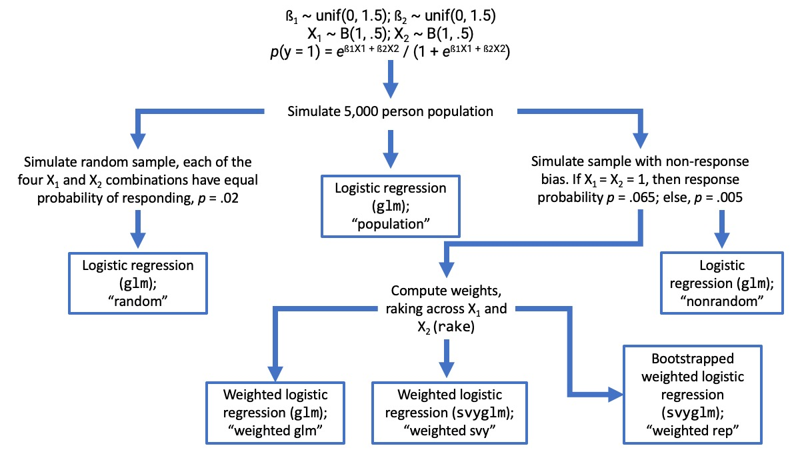

Social science researchers cannot survey all members of populations we study; instead, researchers can survey a sample randomly taken from the population of interest, and then generalize the survey results to the population. These generalizations about a population may be incorrect if the survey sample or respondents do not accurately represent the population to which they belong. For example, this is the case when important demographics of the sample do not match the demographics of the population. Fortunately, we can use survey weighting to leverage information we have about the demographics of a sample and its population to reduce bias in our inferences. Imagine political researchers draw a sample that is 50% registered Democrats from a population that is only 25% registered Democrats. The opinions of Democrats would be over-represented in any conclusions the researchers made about the population. These researchers could correct for Democratic over-representation by reducing the weight of Democrats' opinions such that they only exert influence on 25% of the sample estimate.  

As with any statistical inference, we want to quantify the uncertainty in our results. If market researchers estimate what percentage of people feel positively about Brand X based on a sample, they will want to know the range of possible values this percentage might actually be in the population. Confidence intervals are one way to supply this range of possible values. But how do we obtain valid confidence intervals for weighted survey estimates? It is not as simple as it sounds. Andrew Gelman (2007) famously wrote that "survey weighting is a mess...  standard errors are tricky even with simple weighted means" (p. 153), and this can still feel like the case—especially given the varied use of the word "weights" in statistics.  

Many different types of weights exist, including:  

* Frequency weights, which indicate how many observations have a given covariate profile.  
* Inverse variance weights, used to calculate unbiased estimates in weighted least squares.  
* And survey weights, which can come in many varieties and calculations.  

Design weights are survey weights that derive from the structure of how observations were sampled. For example, a researcher might increase the probability of a minority group being sampled so that accurate estimates about this group can be calculated (Valliant, Dever, & Kreuter, 2013, p. 43); when making inferences to the population as a whole, the researcher would then calculate weights to shrink this group size to the proportion that they are in the population. In more complex survey designs, such as two-stage cluster sampling, one might weight on the probability of an observation's cluster being sampled and then on the probability of an observation within that cluster being sampled. In these cases, the weight is then the inverse of the probability that an observation was sampled (Lumley, 2010).  

In this paper, however, we focus on the use of rake weights to correct for non-response bias. We simulate the specific situation we often encounter in our work: An online survey where all members of a finite population are included in the targeted sample. Horvitz and Thompson (1952) define a finite universe as one where "we can identify the individual elements" (p. 663); in the current example, imagine that we have a list of everyone in the target population of interest. This is the case when we are trying to survey a list of people we think are amenable to buying a product or are open to supporting a candidate. It could also be the case when we are interested in the opinions of everyone in the directory at a given organization. In these scenarios, it is feasible to sample the entire finite population online by sending everyone a link to the survey in an e-mail, message, or digital advertisement. The sampling design is straightforward. We send surveys to everyone, so each person has a sampling probability of 1. However, response rates for online surveys tend to be very low, raising the risk of non-response bias. We use Monte Carlo simulation methods in this paper to examine how to obtain valid confidence intervals for weighted estimates using rake weights.  

## Raking

Raking is also known as "iterative proportional fitting." The "proportional fitting" aspect comes from making adjustments so that the proportion of people of a given group in the respondent data matches that of the population. If the population was 50% women but women only made up 30% of our respondents, then we could increase the weights of women respondents so that they contribute 50% when calculating estimates. An issue arises, however, if we want to weight on many variables; this would require calculating proportions at every possible combination of the variables. But there may be very few people—or none—at, for example, each income-by-gender-by-education-by-race-by-age combination. What we can do instead is make the process "iterative": We start with one variable, calculate weights to make the proportions match for that variable, then move to another variable and do the same. This approach does each grouping variable one-by-one until the weights stop changing. This is one of the most common methods of addressing non-response (Baker et al., 2010, 2013; Mercer, Lau, & Kennedy, 2018). We use the `rake` function from the `survey` R package (Lumley, 2004, 2008, 2010), which calls the package's `postStratify()` function repeatedly until convergence.  

The goal is to weight on every auxiliary variable (those not central to the main analysis but help in obtaining accurate estimates) that is correlated with both (a) the outcome variable of interest and (b) the probability of responding (Kalton & Flores-Vervantes, 2003, pp. 91-92). Imagine we are interested in the proportion of people who feel favorably toward the president, and people who use the Safari internet browser are less likely to respond. This means that (b) is met—browser usage is related to probability of responding. But let's say that browser usage is completely independent of favorability, so (a) is not met. We would not be concerned about this variable. Similarly, assume that Republicans feel more favorably toward the president, but they are equally likely to respond to our survey as Democrats and independents. In this situation, (a) is met, but (b) is not, so again we do not need to be concerned. However, if Republicans were less likely to respond, then both (a) and (b) would be met, and political affiliation would be a variable on which to weight.  

Weighting on variables related to non-response and the outcome eliminates bias in point estimates (Baker et al., 2013, p. 23). But what about standard errors?  

## Problems

Point estimates are not enough for making meaningful inferences—we also need to quantify our uncertainty. A common way to do this is through 95% confidence intervals (CIs), which represent a range of plausible values around the estimate that could be the true value in the entire population. But we need a more formal definition for confidence intervals. If we were to do the same survey an arbitrarily large number of times, then 95% of the 95% CIs would include the true population value (Kline, 2004, pp. 26-30). When we do simulation studies, we are repeating the same simulated survey thousands of times; we know that standard errors are being calculated correctly when 95% of our 95% CIs contain the actual population value.  

Imagine you have just calculated survey weights or a column in a data set given to you contains survey weights. You want to use R to calculate what proportion of people have a value of `1` (as opposed to `0`) for a dichotomous variable `y`, and you would like a standard error around this. What do you do?  

We have to be careful when using weights in R. Different modeling functions can have `weights` arguments that refer to different types of weights. Don't assume that a function's definition of `weights` matches what you are thinking of at the moment. *Always read the documentation to clarify what a given function means by "weights."*  

Lumley (2010) notes: "Most statistical software... will assume that weights are precision weights or frequency weights" and that this "will often (but not always) give correct point estimates, but will usually give seriously incorrect standard errors, confidence intervals, and *p*-values (p. 5)." Since we are modeling a dichotomous variable in this situation, our first thought might be to use the `glm` function with the `binomial("logit")` link. However, the `?glm` documentation tells us that: "For a binomial GLM prior weights are used to give the number of trials when the response is the proportion of successes..." What does this mean? Let's simulate some data to take a look.  

Imagine we have an experiment with 200 participants. When in the experimental condition (`x == 1`), people have a 70% probability of responding positively to our treatment (e.g., voting, donating, purchasing); when in the control (`x == 0`), people have a 30% probability of doing so. When `y == 1`, it is a positive outcome; it is not when `y == 0`. The data might look like this:  

```{r glm_weights_data, message = FALSE, warning = FALSE}
library(tidyverse)
set.seed(1839) # set seed for replicability
n <- 200 # set sample size
x <- rbinom(n, 1, .5) # simulate treatment or control group assignment
y <- rbinom(n, 1, ifelse(x == 1, .7, .3)) # calculate response, based on x
tibble(x, y) # examine the data
```

We can get the proportion of positive outcomes (what the `glm` documents call "proportion of successes") by grouping on `x` and calculating the mean of `y`:  

```{r glm_weights_table}
(trials_table <- tibble(x, y) %>% # take our data...
  group_by(x) %>% # group by the x variable...
  # calculate group size and proportion of successes:
  summarise(n_trials = n(), prop_successes = mean(y)))
```

The `n_trials` column is what `glm` is expecting for weights—the number of trials (i.e., observations) that the proportion of successes (i.e., positive outcomes) is based on. We can see that supplying this `trials_table` with weights is equal to using the raw data of `x` and `y` to about 5 or 6 decimal places:  

```{r comparing_glms}
# model, extract coefficients from weighted model with summary table:
(t1 <- summary(glm(prop_successes ~ x, binomial, trials_table, weights = n_trials))$coef)

(t2 <- summary(glm(y ~ x, binomial))$coef) # do the same for model with raw data

all.equal(t1, t2) # compare to see how far away from equivalent the tables are
```

The rake weights we are interested in do *not* refer to the number of trials, and Lumley (2010) argues that the standard errors will be seriously wrong. We run a simulation experiment to answer two questions: (a) Does using `glm` and giving rake survey weights calculate standard errors incorrectly? and (b) If so, what R functions can we use to calculate accurate standard errors?  

# Methods

## Simulation

The simulation design is pictured in the figure below. Each rectangle box represents a fit model, and we repeat this process 10,000 times. We set the finite population to an *N* = 5,000 for each simulation. We draw two auxiliary variables, *X~1~* and *X~2~*, from a Bernoulli distribution with a probability of .5; that is, each *X* is a dichotomous variable, with each observation having an equal chance of being 0 or 1. *X~1~* and *X~2~* are always simulated as independent of one another—they are uncorrelated. We draw two regression coefficients, one for each *X* variable, from independent uniform distributions ranging from 0 to 1.5. The *X* variables increment the log odds of the outcome variable of interest *Y* = 1 at the rate of their corresponding coefficient. Lastly, we sample each realization of the *Y* variable from a Bernoulli distribution where the probability for each case is transformed from the log odds, mapping onto the assumptions of a logistic regression.  

```{r sim_flow, echo = FALSE, out.width = '70%', fig.align = 'center'}

```

We fit the first model on the entire population, `glm(y ~ 1, binomial, population_data)`. In all models, we fit this intercept-only binomial logistic regression (`y ~ 1`), which calculates (in logits) the proportion of cases where *Y* = 1. The population intercept coefficient serves as ground truth. We assess standard errors in each of the following models by how frequently the 95% CI includes this population ground truth. According to the definition of a 95% CI, we consider standard error calculation methods to be faithfully representing uncertainty if 95% of the CIs contain this population estimate.  

The *X* variables form four groups: *X~1~* = *X~2~* = 1; *X~1~* = *X~2~* = 0; *X~1~* = 0 and *X~2~* = 1; *X~1~* = 1 and *X~2~* = 0. We simulate a random sample from this population data, where every case in each of these groups has a 2% probability of "responding." We fit a model using `glm(y ~ 1, binomial, random_sample)`. This simulates what occurs when non-response bias is *absent*.  

Next, we draw a sample with non-response bias from the population data. We set the response probability to 6.5% when *X~1~* = *X~2~* = 1, 0.5% otherwise. Since the coefficients determining the population values cannot be negative, the observations sampled at 6.5% are always more likely to have *Y* = 1; thus, the non-response will overestimate the estimate. We fit a model to this sample, `glm(y ~ 1, binomial, biased_sample)`, to demonstrate a baseline of how the estimate is biased if we didn't weight.  

We then converted these data with non-response bias to a survey design object in the `survey` package using `dat_design <- svydesign(~ 1, data = biased_sample)`. We calculate rake weights by passing this survey design object to `rake()`. We determine the weighting target from the population data with all 5,000 cases, which assumes a situation where we have marginal proportions for the entire finite universe *without measurement error.* We assign these weights to a variable named `wts` in the biased sample data and then fit three models using this data.  

We pass the weights to the `glm` command as a way of assessing Lumley's (2010) contention that standard errors will be incorrect: `glm(y ~ 1, binomial, biased_sample, wts)`. The `survey` package also includes its own generalized linear models function that employs a sandwich-type estimator for standard errors (see Lumley & Scott, 2017, p. 269). We fit a model using this method, `svyglm(y ~ 1, dat_design, family = binomial)`, to test if this estimator provides a valid 95% CI (note that the `dat_design` object contains the rake weights, so this was a weighted model).  

We pass the `dat_design` object to `as.svrepdesign()` with `type = "bootstrap"` specified; we use the resulting object with `svyglm()` to calculate bootstrapped standard errors. These are known as "replicate" weights in survey literature (Groves et al., 2009, Ch. 10; Lumley, 2010, Ch. 2). Bootstrapping involves drawing *R* resamples from the sample, with replacement, and calculating the estimates for each resample. We then consider the standard deviation of the estimates across resamples to be the standard error of the estimate. We employ the `as.svrepdesign()` default *R* = 50 here. See Canty and Davison (1999) for the specific bootstrapping implementation used here, and Kline (2004, Ch. 9) for a broader introduction to resampling methods, including bootstrapping.  

For each simulation iteration, we calculate the estimate for each model and a logical value for all models (save for the population model) indicating whether or not the 95% CI for the estimate contained the population value. The results look like:  

```{r, message = FALSE}
results <- read_csv("sim_results.csv")
head(results)
```

# Results and Conclusion

The only model that did not approximate the population estimate in the long-run was the model calculated with the non-response bias and _no_ weighting (see table below), supporting Lumley's (2010) contention that weighted estimates—regardless of standard error calculation—will tend to be unbiased. All weighted models also showed the exact same estimates.  

```{r}
results %>% 
  select_if(is.double) %>% 
  colMeans() %>% 
  as.matrix()
```

But we do not have the luxury of observing the long-run average in applied research—we see just one of these iterations. We would like to use a method that has a narrow spread—where we rarely stray too far away from the population value. Pictured below are density plots of estimates over all 10,000 simulations. The first panel shows how much the estimate varied in the actual population values, while the panel directly right of it shows what we see from a sample drawn randomly from it, with no non-response bias. The bottom three distributions are from the weighted models, and again we see that they are all the same—what will differ only are their calculated standard errors.  

We can also see that the spread for the weighted estimates is wider than for the random sample, which shows us that we need a standard error calculation that appreciates this spread. If we use a standard error calculation that assumes the distribution looks like the random one (with no non-response bias), we will underestimate our standard errors, 95% CIs, and *p*-values.  

```{r}
labs <- c("Population", "Random", "Non-Random", "Weighted glm", 
          "Weighted svyglm", "Weighted, Bootstrapped svyglm")
levs <- c("pop", "random", "nonrandom", "wtdglm", "wtdsvy", "wtdrep")
names(labs) <- levs

results %>% 
  select_if(is.double) %>% 
  gather() %>% 
  mutate(key = gsub("_est", "", key),
         key = factor(key, levs)) %>% 
  ggplot(aes(x = value, fill = key)) +
  geom_density(alpha = .5) +
  facet_wrap(~ key, labeller = as_labeller(labs), strip.position = "top") +
  theme(legend.position = "none")
```

Are the CIs properly characterizing uncertainty? Remember: If we run a survey a large number of times, 95% of the 95% CIs should contain the true population estimate. We can test if this is the case by calculating the coverage of each model—what percentage of the time did the 95% CI cover the population estimate?  

```{r}
results %>% 
  select_if(is.logical) %>% 
  colMeans() %>% 
  as.matrix()
```

The random sample coverage is about 95%, which is what we would expect from taking a sample from the population where the response probability does not depend on any predictors of the outcome of interest. The model calculated from the biased data and with no weighting only includes the population estimate about 36% of the time, but this is what we would expect from a model that is getting an incorrect estimate. What of the weighted models that yield unbiased estimates?  

Including weights in the `glm()` function as if they were frequency weights yields what Lumley (2010) warned: Standard errors that are "seriously incorrect." There was only about 68% coverage, meaning that these 95% CIs were actually only 68% CIs. Using the `svyglm()` function increased this to 90% coverage, but this still means that the 95% CI is not correctly disclosing the uncertainty at hand—it would be more accurate to call it a 90% CI. Only when we used the 50 bootstrap resamples did it approach 95%, as the weighted replicate model had about 93% coverage.  

From these results, our recommendation would be to calculate 95% CIs using code like:  

```{r, eval = FALSE}
dat_design <- svydesign(~ 1, data = dat) # convert data to survey design
dat_design <- rake(
  dat_design, 
  sample.margins = list(~V1, ~V2), # list of formulas specifying raking variables
  population.margins = pop_targets # list of data frames showing desired counts
)
dat_design <- as.svrepdesign(dat_design, type = "bootstrap") # bootstrap
model <- svyglm(y ~ 1, dat_design, family = binomial) # run model
```

The full simulation code can be found on [GitHub](https://github.com/markhwhiteii/blog/blob/master/weights_troubles/weighting_simulations.R).  

## Limitations

Even though the confidence intervals tended to underestimate uncertainty, these simulations were still quite optimistic. They represented a best case scenario. First, there was no error in measuring the variables on which we raked—they were perfect measurements. Second, we had the exact population estimates—this is generally the case when we have a pre-defined list of people we want to survey, but sometimes we only have estimated population totals available. Third, we were weighting on exactly the variables—and only the variables—that relate to both non-response and outcome. In applied situations, these assumptions (particularly the first and third) will not hold, and thus we argue people should be even less confident that 95% CIs are valid. In a weighted survey context, we should be especially skeptical when looking at CIs.  

## References

Baker, R., et al. (2010). Research synthesis: AAPOR report on online panels. *Public Opinion Quarterly, 74*(4), 711-781.  

Baker, R., et al. (2013). *Report of the AAPOR task force on non-probability sampling*. AAPOR.  

Canty, A. J., & Davison, A. C. (1999). Resampling-based variance estimation for labour force surveys. *Journal of the Royal Statistical Society. Series D, 48*(3), 379-391.  

Gelman, A. (2007). Struggles with survey weighting and regression modeling. *Statistical Science, 22*(2), 153-164.  

Groves, R. M., Fowler, F. J., Couper, M. P., Lepkowski, J. M., Singer, E., & Tourangeau, R. (2009). *Survey methodology*. 2nd edition, Wiley.  

Horvitz, D. G., & Thompson, D. J. (1952). A generalization of sampling without replacement from a finite universe. *Journal of the American Statistical Association, 47*(260), 663-685.  

Kalton, G., & Flores-Vervantes, I. (2003). Weighting methods. *Journal of Official Statistics, 19*(2), 81-97.  

Kline, R. B. (2004). *Beyond significance testing: Reforming data analysis methods in behavioral research*. American Psychological Association.  

Mercer, A., Lau, A., & Kennedy, C. (2018). *For weighting online opt-in samples, what matters most?* Pew Research Center.  

Lumley, T. (2004). Analysis of complex survey samples. *Journal of Statistical Software, 9*(8), 1-19.  

Lumley, T. (2008). Analysis of complex samples in R. *The Survey Statistician, 57*, 20-25.  

Lumley, T. (2010). *Complex surveys: A guide to analysis using R*. Wiley.  

Lumley, T. & Scott, A. (2017). Fitting regression models to survey data. *Statistical Science, 32*(2), 265-278.  

Valliant, R., Dever, J. A., & Kreuter, F. (2013). *Practical tools for designing and weighting survey samples*. Springer.  
